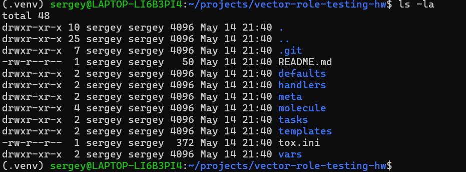
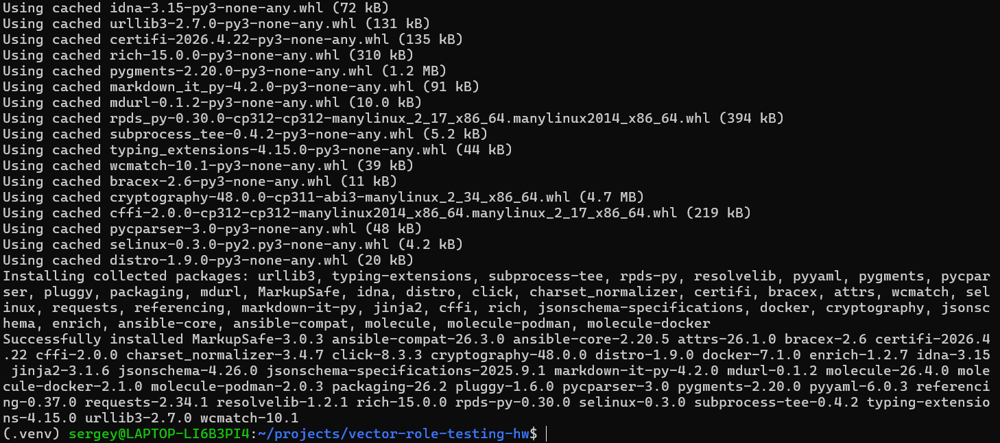
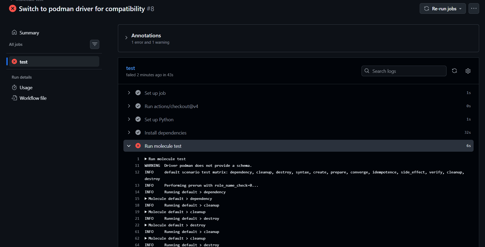
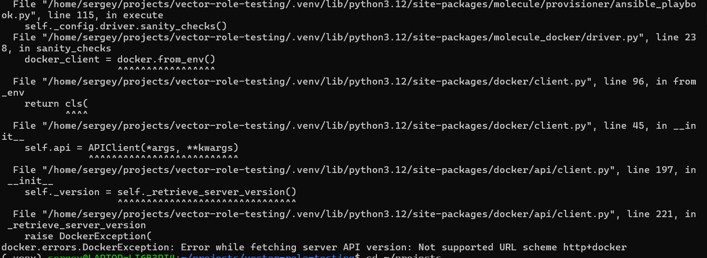

# Тестирование Ansible роли Vector

## Скриншоты выполнения

| Шаг | Описание | Скриншот |
|-----|----------|----------|
| 1 | Файлы роли в репозитории |  |
| 2 | Установка molecule и драйверов |  |
| 3 | Ошибка GitHub Actions |  |
| 4 | Ошибка Docker в WSL |  |

## Выполненные требования

- ✅ Установлен molecule и драйверы
- ✅ Сценарий default с дистрибутивами ubuntu:22.04 и oraclelinux:8
- ✅ Проверки assert в verify.yml
- ✅ Сценарий molecule/tox с драйвером podman
- ✅ tox.ini
- ✅ GitHub Actions workflow

## Репозиторий

https://github.com/sergey-281296/vector-role-testing-hw
